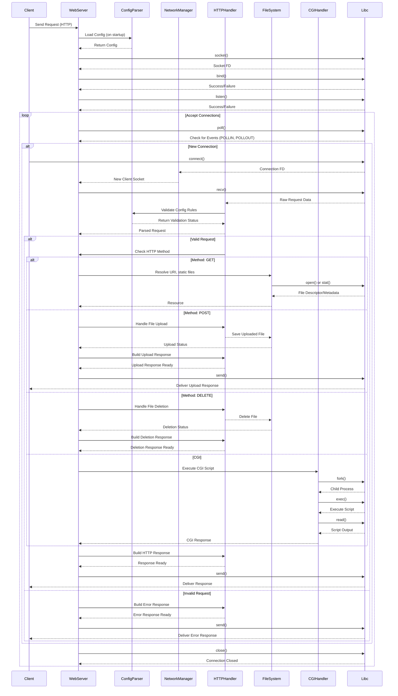

# Sequence Diagram Explanation for `webserv` Project

The sequence diagram illustrates how different components interact within the `webserv` architecture during the lifecycle of handling an HTTP request. It outlines the flow of information and control from the moment a client sends a request until the server responds.

#
## Detailed Explanation of Each Step

### 1. Client Sends Request
- The process starts when a client (e.g., a web browser) sends an HTTP request to the web server. This interaction is represented by the arrow from **Client** to **WebServer** with the message **"Send Request (HTTP)"**.

### 2. Server Initialization
- The **WebServer** initiates by loading the configuration settings.
- It communicates with **ConfigParser** to read the server configuration file, which contains parameters such as server ports, document root, and routing rules. This is represented by the interaction **"Load Config (on startup)"** and the subsequent return of the parsed configuration.

### 3. Socket Initialization
- After loading the configuration, the **WebServer** calls the `socket()` function from the **Libc** (standard C library) to create a new socket.
- **Libc** returns a socket file descriptor (FD), which is essential for network communication.
- The server then proceeds to **bind** the socket to a specific address and port (e.g., `localhost:80`) using the `bind()` function. This operation is critical for establishing where the server will listen for incoming connections.
- Finally, the **WebServer** calls `listen()` to start accepting connections, indicating that it is ready to handle incoming client requests.

### 4. Accepting Connections
- The server enters a loop to accept incoming connections from clients.
- The **WebServer** calls `poll()` on the socket to check for events, such as incoming connections (`POLLIN`) or readiness to send data (`POLLOUT`).

### 5. Handling New Connections or Requests
- **If a new connection** is detected:
  - The **Libc** handles the connection through the `connect()` function, which establishes a connection to the server.
  - Once the connection is accepted, **NetworkManager** retrieves the new client socket and passes it back to the **WebServer** for further processing.

### 6. Receiving and Parsing the Request
- The **WebServer** calls the `recv()` function to read data from the client socket. This function waits for the client to send an HTTP request and reads the incoming data.
- The raw request data is passed to the **HTTPHandler**, which is responsible for parsing the HTTP request.
- The **HTTPHandler** validates the request against the server configuration (e.g., checking allowed methods, content types, etc.) by querying the **ConfigParser**.
- The result of the validation is returned to the **HTTPHandler**, which confirms whether the request is valid.

### 7. Handling Valid Requests
- **If the request is valid**:
  - The **WebServer** checks the HTTP method used in the request:
    - **GET**: The server resolves the requested URI and checks if it's a static file. The **FileSystem** component interacts with **Libc** by calling `open()` or `stat()` to check for the requested resource. **Libc** returns either a file descriptor for the resource or metadata indicating the file's status (e.g., not found). The resource is then sent back to the **WebServer**.
    - **POST**: If the request is for a file upload, the **WebServer** directs the request to the **HTTPHandler**, which processes the file upload. The uploaded file is saved using the **FileSystem** component. The upload status is returned to the **WebServer**, which then builds the upload response and sends it back to the client using the `send()` function.
    - **DELETE**: For file deletion requests, the server directs the request to the **HTTPHandler**, which deletes the specified file via the **FileSystem**. The deletion status is returned, and an appropriate response is generated.
    - **CGI**: If the request requires executing a CGI script, the server interacts with the **CGIHandler** to generate a dynamic response, which is returned to the **WebServer**.
  - After determining the resource or action to perform, the **WebServer** instructs the **HTTPHandler** to construct an HTTP response based on the outcome.
  - The completed response is sent back to the client using the `send()` function, which writes the HTTP response data to the client socket.

### 8. Handling Invalid Requests
- **If the request is invalid**:
  - The **WebServer** calls the **HTTPHandler** to build an appropriate error response (e.g., `400 Bad Request`, `404 Not Found`, etc.).
  - The error response is constructed and sent back to the **WebServer**.
  - Just like with valid requests, the response is delivered to the client using the `send()` function.

### 9. Connection Management
- After processing the request (whether valid, invalid, or a file upload), the **WebServer** chooses to keep the connection open for persistent connections or closes the client connection using the `close()` function from **Libc** as needed. This ensures that system resources are freed and that the server can efficiently manage open connections.

### 10. Loop Continuation
- The server continues to listen for new connections in a loop, repeating the process for each incoming client request.

## Key Concepts Illustrated in the Sequence Diagram
- **Separation of Concerns**: Each component has a distinct role (configuration, networking, HTTP handling, CGI execution), promoting modularity and ease of maintenance.
- **Error Handling**: The diagram illustrates the server’s ability to differentiate between valid and invalid requests and handle errors accordingly.
- **Polling Mechanism**: The use of `poll()` allows the server to efficiently wait for events without busy-waiting, optimizing resource usage.
- **Dynamic Content Handling**: The diagram shows the interaction with a CGI handler, allowing the server to generate dynamic responses based on client requests.
- **File Upload Handling**: The process for handling file uploads is clearly delineated, ensuring the server properly manages the upload before any potential connection closure.
- **Library Interaction**: External library functions are included to represent critical system interactions, providing clarity on how the server communicates with the underlying operating system.
- **Client-Server Communication**: The diagram captures the essential back-and-forth communication between the client and the server, highlighting the importance of sockets in network programming.

## Conclusion
The sequence diagram serves as a comprehensive overview of the operational flow within the `webserv` project, detailing how requests are received, processed, and responded to. It highlights key components and their interactions, emphasizing the modular design and error handling of the server architecture. This visualization is beneficial for both understanding the system's functionality and communicating its design to team members or stakeholders.
